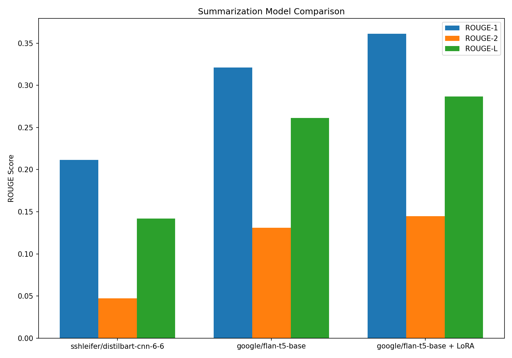
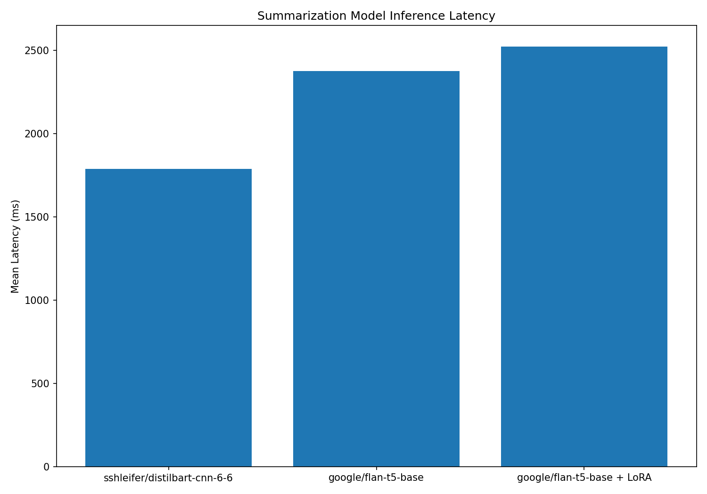
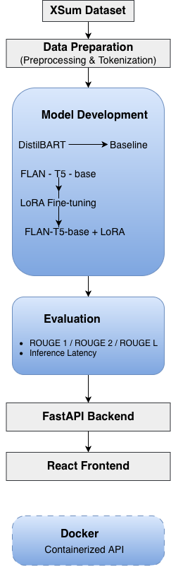
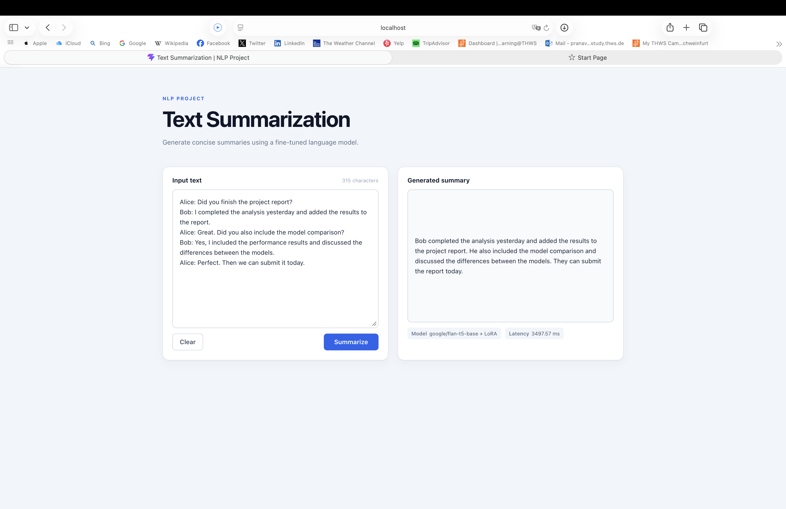

# 📝 End-to-End NLP Text Summarization

*An end-to-end Transformer-based summarization system with LoRA fine-tuning, model benchmarking, FastAPI inference, React frontend, and Docker support.*

---

## 📌 Overview

This project implements an end-to-end **Transformer-based text and dialogue summarization system**.

It covers the full workflow from **XSum dataset preparation and LoRA fine-tuning to model evaluation and local inference**. The project also compares different Transformer models and provides a **FastAPI backend, React frontend, and Docker setup** for running the summarization system locally.

### Key Highlights

- 🤗 Transformer-based summarization with **FLAN-T5-base**
- 🔧 Parameter-efficient fine-tuning using **LoRA**
- 📊 Benchmarking of **DistilBART, FLAN-T5-base, and FLAN-T5-base + LoRA**
- 📈 ROUGE-based evaluation and inference latency analysis
- 🚀 FastAPI inference service
- ⚛️ React frontend for interactive summarization
- 🐳 Dockerized application
- 🧪 Automated testing with **57 tests**

---

## 📊 Key Results

The models were evaluated on a **20-example subset of the XSum test set**.

| Model | ROUGE-1 | ROUGE-2 | ROUGE-L | Avg. Latency |
|---|---:|---:|---:|---:|
| DistilBART | 21.15% | 4.74% | 14.21% | 1789.6 ms |
| FLAN-T5-base | 32.11% | 13.11% | 26.13% | 2377.0 ms |
| **FLAN-T5-base + LoRA** | **36.11%** | **14.49%** | **28.68%** | 2523.1 ms |

> **Note:** Results are based on a 20-example evaluation subset and are intended for model comparison rather than full-dataset performance reporting.

### ROUGE Comparison



### Inference Latency Comparison



---

## 🏗️ Approach

The workflow covers data preparation, model fine-tuning, evaluation, and local inference.



---

## 📚 Dataset

The project uses the **XSum (Extreme Summarization)** dataset for abstractive text summarization.

XSum contains news articles paired with short, highly abstractive summaries, making it suitable for evaluating Transformer-based sequence-to-sequence summarization models.

### Dataset Characteristics

- **Dataset:** XSum
- **Task:** Abstractive text summarization
- **Input:** News article
- **Target:** Short summary

---

## 🤖 Models & LoRA Fine-Tuning

The project evaluates three Transformer-based summarization models:

- **DistilBART** — Lightweight baseline
- **FLAN-T5-base** — Instruction-tuned baseline
- **FLAN-T5-base + LoRA** — Parameter-efficient fine-tuned model

**LoRA (Low-Rank Adaptation)** was used to adapt FLAN-T5-base to the summarization task while keeping most of the pretrained model parameters frozen.

---

## 📈 Evaluation

The models are evaluated using **ROUGE-1, ROUGE-2, and ROUGE-L** to measure summarization quality. The project also benchmarks **inference latency** to compare the trade-off between summary quality and runtime performance.

---

## 🖥️ Application

The project includes a React frontend connected to the FastAPI inference backend for local text and dialogue summarization.



---

## 🚀 Installation & Local Setup

### 1. Clone the Repository

```bash
git clone https://github.com/Sah-Pranav/End-to-End-NLP-Project.git
cd End-to-End-NLP-Project/NLP
```

### 2. Create and Activate a Virtual Environment

```bash
python3.11 -m venv .venv
source .venv/bin/activate
```

### 3. Install Dependencies

```bash
pip install -r requirements.txt
```

For development and testing:

```bash
pip install -r requirements-dev.txt
```
---

## ▶️ Run the Application

### Backend

Start the FastAPI server:

```bash
uvicorn summarization.api:app --host 0.0.0.0 --port 8000
```

The API will be available at:

    http://localhost:8000

Interactive API documentation:

    http://localhost:8000/docs

### Frontend

Open a second terminal:

```bash
cd frontend
npm install
npm run dev
```

The frontend will be available at:

    http://localhost:5173


---

## 🐳 Docker

The FastAPI inference service can be run locally using Docker.

### Build the Image

```bash
    docker build -t text-summarizer-api
```

### Run the Container

```bash
    docker run --name text-summarizer-api -p 8000:8000 text-summarizer-api
```

The API will be available at:

    http://localhost:8000

---

## 🧪 Testing

The project includes automated tests covering data processing, model components, configuration, inference, API behaviour, and supporting utilities.

Run the test suite with:

```bash
pytest -q
```

**57 tests passed** in the current test suite.

---

## 📁 Project Structure

    NLP/
    ├── config/                 # Project configuration
    ├── docs/results/           # Benchmark visualizations
    ├── frontend/               # React frontend
    ├── scripts/                # Training, prediction, and benchmarking scripts
    ├── src/summarization/     # Core summarization package
    ├── tests/                  # Automated tests
    ├── Dockerfile
    ├── params.yaml
    ├── pyproject.toml
    ├── requirements.txt
    └── README.md

---

## 🛠️ Tech Stack

### 🤖 Machine Learning & NLP


**Dataset & Evaluation:**  Hugging Face Datasets · ROUGE · NumPy · Pandas · Matplotlib

### 🚀 Application


### 🐳 Infrastructure & Development


---

## ⚠️ Limitations & Future Work

- Evaluation is currently based on a **20-example XSum test subset**.
- Input sequences are limited to **512 tokens**.
- The LoRA model has higher inference latency than the DistilBART baseline.
- Future improvements include **long-document summarization, larger Transformer models, broader evaluation, and production deployment**.

---

## 👨‍💻 Developed By

**Pranav Kumar Sah**
